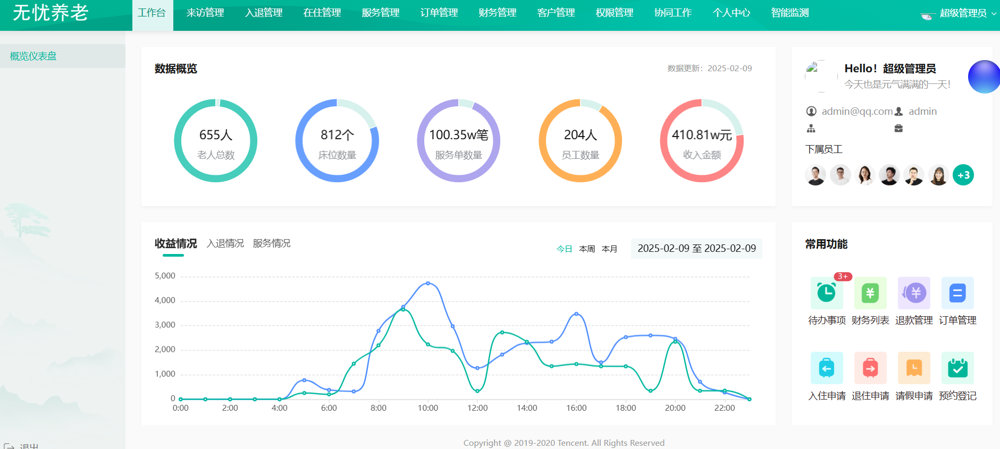

# 无忧养老项目

## 项目介绍

基于springboot+vue3+WebSocket+阿里云IOT开发的一款智能化养老服务管理系统。

涵盖了智能健康监测、权限管理、订单管理等多个功能模块，旨在为养老服务机构提供信息化管理方案，同时实时握老人的健康状况和护理情况，提高服务质量，减少管理成本。1）用户登录后进入工作台，可以方便地查看一些数据。

2）服务管理：管理员可以在服务管理模块中对护理项目进行增删改查、启用、禁用操作。

3）数据权限管理：对于同一类数据，拥有不同角色的用户看到的数据可能是不同的。

4）设备管理：在阿里云IOT平台创建产品后，可以直接在系统上对设备进行增删改查、查看设备数据操作。

5）智能床位：通过在房间、床位、老人上绑定智能设备后，管理员可以在系统上监控设备运行情况，老人健康情况。同时当系统检测到设备有异常数据时，会立即自动通知管理员及相关人员。

**系统架构**

**技术架构**

## 技术选型

### 后端

- Java Spring Boot 框架
- MySQL 数据库 + MyBatis框架 + MyBatis X
- Redis + spring cache缓存
- ⭐️ WebSocket 双向通信